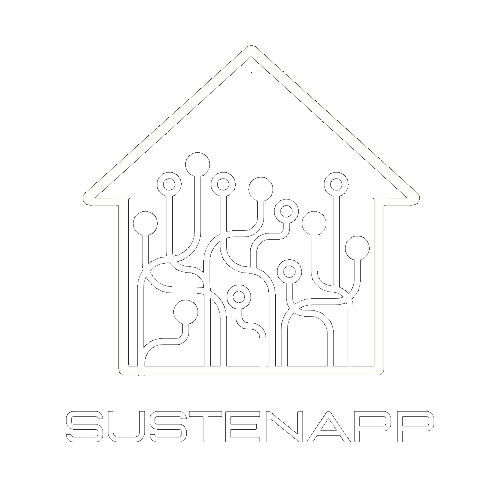

<h1 align=center>SUSTENAPP-ARDUINO</h1>

<p align="center">
  
</p>

#
### TECNOLOGIAS

&nbsp;
&nbsp;
&nbsp;

#
### DOCUMENTACAO DA APLICACAO

- CONTROLE DE DISPOSITIVO
```
{
	"comando": "controlador",
	"porta": <int>
}
```

- ESTADO DE DISPOSITIVO
```
{
	"comando": "dispositivo",
	"porta": <int>,
	"estado": <int>
}
```

- DECLARACAO DE VARIAVEL DE RESERVATORIO
```
{
    	"comando": "declaracao",
    	"tipo": "reservatorio",
	"capacidade" : <double>
}
```

- ATUALIZACAO DE CONSUMO
```
{
	"comando": "consumo",
	"tipo": <hidrico/eletrico>,
	"renovavel": <bool>,
	"consumo": <float>,
	"unidade": <str>
}
```
